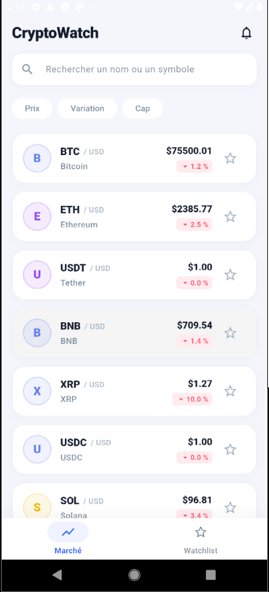
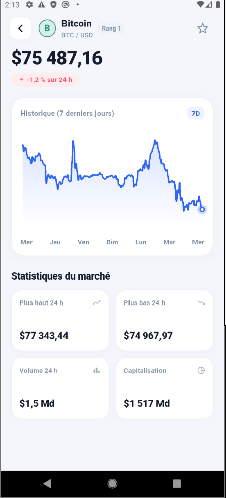
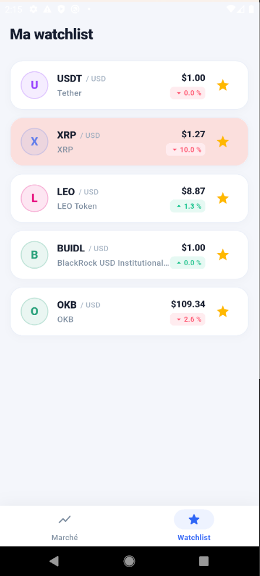
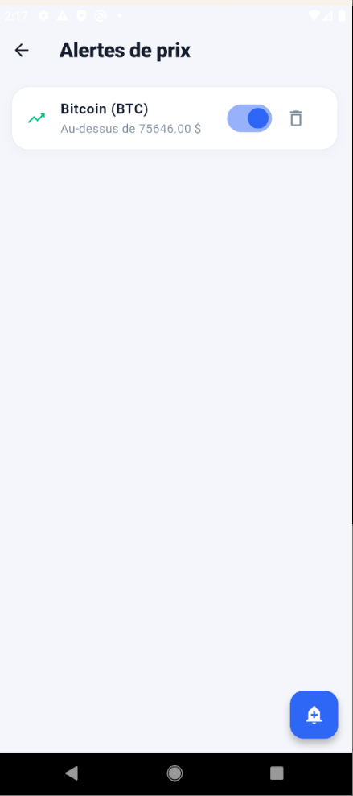
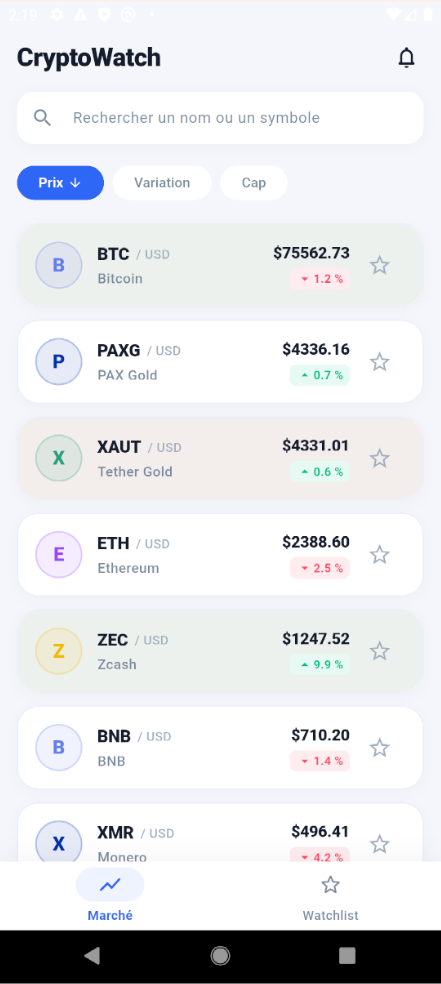
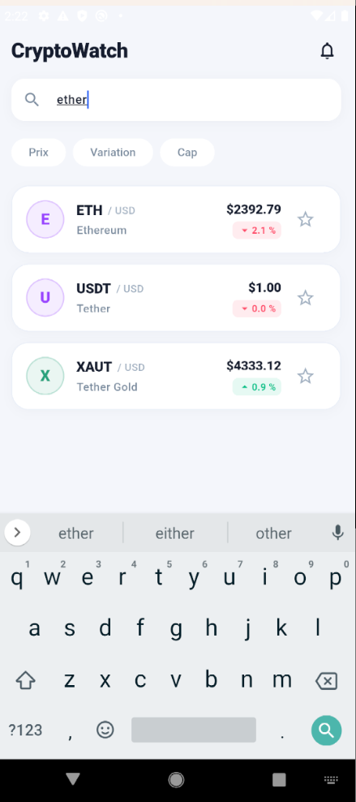
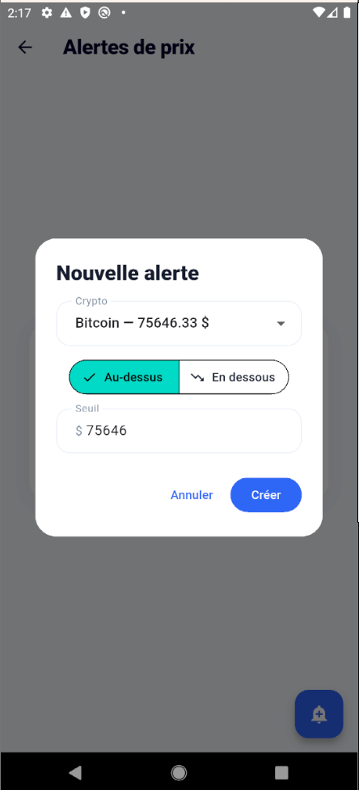
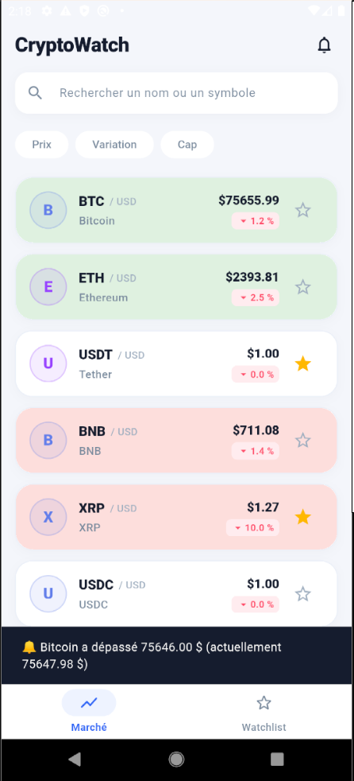

# CryptoWatch 🪙


🚀 **Projet : CryptoWatch**
Application mobile de suivi des cours de cryptomonnaies en temps réel : liste du
marché avec prix en direct (WebSocket), recherche et tri, fiche détaillée avec
courbe 7 jours, watchlist personnelle et alertes de prix avec notification.

📅 _Début :_ 2 septembre 2026 · 🏁 _Fin :_ 16 septembre 2026

👥 **Membres de l'équipe :**
Guy Eclador TETANG · Joseph Tchapo NABOUDJA · Ruben Esli Guelahibi TONETY ·
Uriel HOUEGBE · Yannick Ulrich OUEDRAOGO · Eliel Koni Gmiminou COULIBALY

👨‍💼 **Chef d'équipe :** Eliel Koni Gmiminou COULIBALY
🎓 **Mentor :** David BONGOUADE

---

## 1. L'application

| Écran                  | Ce qu'il fait                                                                                                                                                                                                                      |
| ---------------------- | ---------------------------------------------------------------------------------------------------------------------------------------------------------------------------------------------------------------------------------- |
| **Marché**             | Top 50 par capitalisation, prix mis à jour **en direct** (flash vert/rouge à chaque variation) · recherche par nom ou symbole · tri par prix, variation ou capitalisation (ordre inversable) · étoile watchlist · cloche → alertes |
| **Fiche crypto**       | Prix, variation 24h, plus haut/plus bas, volume, capitalisation, rang · **courbe d'évolution 7 jours** (données réelles CoinGecko) · étoile watchlist · états chargement/erreur/réessayer                                          |
| **Watchlist**          | Les cryptos étoilées, avec les **mêmes prix vivants** que le marché · état vide avec invitation                                                                                                                                    |
| **Alertes** 🎁 _bonus_ | Créer une alerte « au-dessus / en dessous de X $ » sur n'importe quelle crypto · notification in-app dès le franchissement du seuil, où qu'on soit dans l'app · anti-martèlement (cooldown 5 min) · activer/désactiver/supprimer   |

Navigation : 2 onglets (Marché / Watchlist) · tap sur une carte → Fiche ·
cloche (AppBar du marché) → Alertes. Fiche et Alertes s'ouvrent **au-dessus**
des onglets.

### Captures d'écran

| Marché (temps réel)                    | Fiche crypto                         | Watchlist                                    | Alertes                                  |
| -------------------------------------- | ------------------------------------ | -------------------------------------------- | ---------------------------------------- |
|  |  |  |  |

| Tri par prix                     | Recherche                                    | Nouvelle alerte                                 | Alerte déclenchée                                       |
| -------------------------------- | -------------------------------------------- | ----------------------------------------------- | ------------------------------------------------------- |
|  |  |  |  |

**Gestion des erreurs visible** : chaque type de panne a son message - pas de
connexion, délai dépassé, limite d'appels CoinGecko (429), serveur indisponible,
données invalides - avec bouton Réessayer.

---

## 2. Lancer le projet

```bash
git clone https://github.com/Cooleliel/cryptowatch.git
cd cryptowatch          # main = version stable du rendu
flutter pub get
flutter run
```

Aucune clé API, aucun secret : les deux sources de données sont publiques.
📦 **APK Android** : disponible en pièce jointe de la dernière release GitHub.

Vérification avant tout push : `flutter analyze && flutter test`.

---

## 3. Architecture

**Feature-first, 3 couches par feature** (clean architecture allégée) :

```
lib/
├── main.dart
├── app/                       # L'application entière
│   ├── app.dart               # Widget racine (thème clair, router)
│   ├── router/                # Toutes les routes (go_router, StatefulShellRoute)
│   ├── theme/                 # Palette et thème partagés
│   └── widgets/               # AppShell : onglets + écoute globale des alertes
│
├── features/
│   ├── market/                # Marché : liste, recherche, tri, temps réel, flash
│   │   ├── domain/            #   Crypto, BinanceTicker (Dart pur)
│   │   ├── data/              #   MarketRepository, RealtimeService (WebSocket)
│   │   └── presentation/      #   écrans, cartes, providers
│   ├── crypto_detail/         # Fiche : historique 7 jours, courbe CustomPainter
│   ├── watchlist/             # Favoris de session, branchés sur le marché vivant
│   └── alerts/                # 🎁 Alertes de prix (bonus)
│
└── shared/                    # Utilisé par PLUSIEURS features
    ├── errors/                # AppException : hiérarchie sealed des pannes
    ├── logging/               # AppLog : traçage injectable et testé
    └── widgets/               # Widgets transverses (bannière de notification)
```

**La règle d'or des imports** : `presentation ──► data ──► domain` — les flèches
pointent vers `domain`, jamais l'inverse. `domain` est du Dart pur (zéro import
Flutter), testable en console.

**Règle `shared/`** : un élément naît dans SA feature ; il ne déménage dans
`shared/` que le jour où une **deuxième** feature en a besoin. `AppException`
en est l'exemple vécu : née dans market, partagée quand crypto_detail l'a
consommée.

### Standards techniques du projet

- **État : Riverpod, partout.** Providers dérivés pour tout ce qui se calcule
  (la liste affichée = données × filtre × tri, jamais stockée), `AsyncNotifier`
  pour les données réseau, `ref.listen` pour réagir aux changements (jamais de
  mutation pendant un build), `autoDispose` pour les ressources par-écran.
- **Erreurs : hiérarchie `sealed`.** Le `switch` sur `AppException` est
  exhaustif - ajouter un type de panne sans le traiter ne compile pas. Tout
  `catch` non relancé DOIT tracer via `AppLog` (règle testée : les tests
  vérifient qu'aucune erreur n'est silencieuse).
- **Injection par constructeur** : client HTTP, fabrique WebSocket, horloge -
  tout ce qui touche l'extérieur est injectable, donc testable sans réseau.

---

## 4. Les sources de données

Deux APIs gratuites et complémentaires - **« CoinGecko donne naissance aux
données, Binance les fait évoluer »** :

- **CoinGecko (REST)** - l'annuaire :
  - Liste : `https://api.coingecko.com/api/v3/coins/markets?vs_currency=usd&order=market_cap_desc&per_page=50&page=1` → 50 cryptos complètes
  - Historique : `https://api.coingecko.com/api/v3/coins/{id}/market_chart?vs_currency=usd&days=7` → ~169 points horaires
  - Le rate-limit du plan public est géré : un 429 affiche son propre message.
- **Binance (WebSocket)** - le pouls :
  - Flux global : `wss://stream.binance.com:9443/ws/!miniTicker@arr` - un seul
    canal pour toutes les paires, ~1 message/seconde contenant des centaines de
    tickers.
  - **Reconnexion automatique** à délai croissant (1 s → 30 s max, remis à zéro
    dès qu'un message arrive) ; les messages illisibles sont ignorés et tracés.

### Performance (critère du focus technique)

Trois couches de défense, chacune verrouillée par un test :

1. **Filtrage à l'entrée** : un tick pour un symbole hors de notre top 50 est
   jeté avant toute reconstruction (~90 % du flux) - testé : aucun rebuild,
   aucune notification.
2. **Redessin par carte** : chaque carte s'abonne par `select` à SA crypto -
   un tick BTC ne redessine que la carte BTC, jamais la liste.
3. **Ressources auto-libérées** : les providers de flash sont
   `autoDispose.family` - les timers meurent quand la carte sort de l'écran.

---

## 5. Tests et intégration continue

- **tests** : unitaires (modèles, exceptions, cooldown des alertes),
  providers (états, filtre+tri, temps réel simulé, cooldown à horloge
  injectée), widgets (cartes, écrans, recherche, tri) et intégration
  bout-en-bout (navigation liste → fiche, parcours favori, reconnexion
  WebSocket à horloge simulée - aucun test n'ouvre de vrai réseau).
- **CI GitHub Actions** : `flutter analyze` + `flutter test` obligatoires et
  verts avant tout merge .

---

## 6. Organisation d'équipe

- `main` : stable, releases par jalons (visibles dans l'onglet Releases, APK
  joint) · `dev` : intégration · `feature/<initiale>/T-XX-description` : une
  branche par tâche par membre.
- **PR obligatoire** avec description, tests, review d'un coéquipier et CI
  verte avant merge. 6 contributeurs visibles sur le repo.
- Suivi : backlog de tâches numérotées T-XX, feuille de suivi quotidienne .

---
